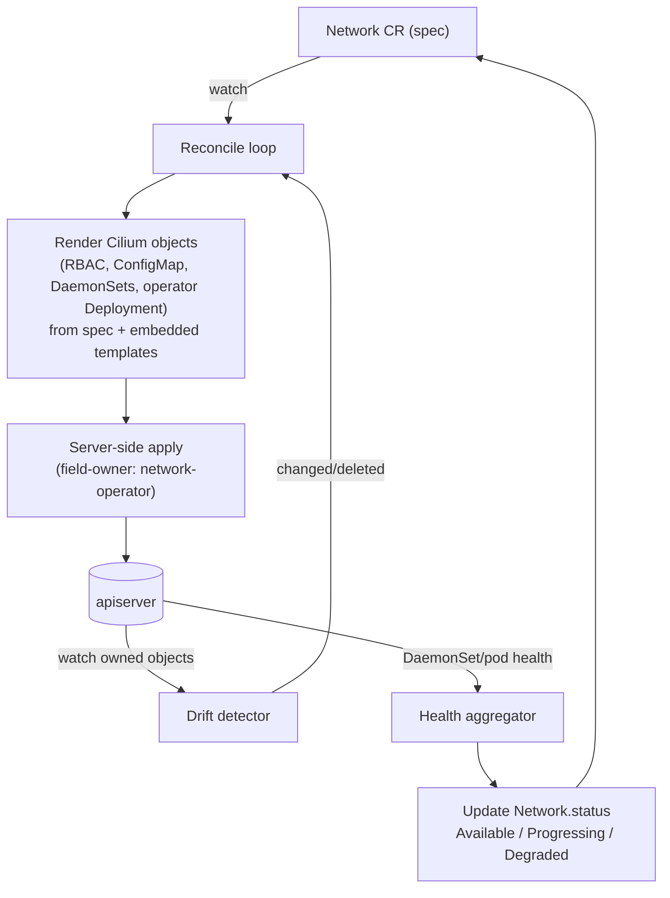

# network-operator

The **Cluster Network Operator** for the rustkube / stormcos stack, in Rust.

It owns the **lifecycle of the cluster network (Cilium)** — install, configure,
upgrade, reconcile, and health-report — driven by a single declarative
`Network` custom resource. It is the stack's analog of OpenShift's
**Cluster Network Operator (CNO)**.

> **Not** the same as `cilium-operator`. `cilium-operator` is Cilium's *own*
> control plane (CRDs, IPAM allocation, identity/endpoint GC — it manages
> Cilium's **data**). `network-operator` manages Cilium's **installation and
> lifecycle** — the DaemonSets, the operator Deployment, the config, and their
> upgrades — and reports whether the network is healthy.

## Why this exists

Installing a CNI by hand (`helm install` / `kubectl apply -f cilium.yaml`) has no
reconciliation, no declarative upgrades, and no status. OpenShift never does
that — the CNI is always owned by an operator (CNO for OVN‑Kubernetes; the Cilium
OLM operator + a `CiliumConfig` CR for certified Cilium). `network-operator`
brings that model to our stack:

- **Declarative** — one `Network` CR is the source of truth for the whole CNI.
- **Self-healing** — config drift, a deleted DaemonSet, or a hand-edited
  ConfigMap are reconciled back to the CR (the stack's self-healing requirement,
  applied at the install layer).
- **Upgrades** — bump the version in the CR; the operator rolls it out.
- **Status** — the network's health is a first-class, queryable condition
  (`Available` / `Progressing` / `Degraded`), like a cluster operator.

## Scope

- **In:** the sole CNI, **Cilium** — RBAC, ConfigMap, `cilium` + `cilium-envoy`
  DaemonSets, `cilium-operator` Deployment, and the Cilium config knobs
  (kube-proxy replacement, IPAM mode, routing mode, LB‑IPAM / BGP).
- **Out:** the pre-cluster control-plane VIP — that's
  [stormlb](https://github.com/glennswest/stormlb), which runs *before* the
  cluster and can't be a cluster workload. The two are complementary: stormlb
  fronts the apiserver; network-operator manages in-cluster networking.

## The `Network` custom resource

Desired state for the whole cluster network. One object, cluster-scoped.

```yaml
apiVersion: network.storm.io/v1
kind: Network
metadata:
  name: cluster
spec:
  cni: cilium
  # A named mode picks a Cilium profile at install time (see "Network modes").
  # It sets sane defaults for the fields below; anything set explicitly overrides
  # the mode's default.
  mode: overlay                       # overlay | native | bgp | encrypted | bare-metal
  clusterNetwork: ["10.244.0.0/16"]   # pod CIDR(s)  (OpenShift: networking.clusterNetwork)
  serviceNetwork: ["10.96.0.0/12"]    # service CIDR (OpenShift: networking.serviceNetwork)
  cilium:
    version: "1.19.6"                 # image tag; bumping it triggers a rollout
    ipam:
      mode: cluster-pool              # cluster-pool | kubernetes
      clusterPoolIPv4MaskSize: 24
    routing:
      mode: tunnel                    # tunnel (VXLAN/Geneve) | native
    mtu: 0                            # 0 = auto (node MTU - overhead), like CNO
    kubeProxyReplacement: true        # eBPF ClusterIP/NodePort/LB/HostPort
    hostRouting: bpf                  # bpf | legacy  (≈ OVN shared vs local gateway)
    encryption:
      type: none                      # none | wireguard | ipsec  (runtime-changeable)
    k8sServiceHost: "192.168.8.98"    # apiserver the agent dials before Services exist
    k8sServicePort: 6443
    loadBalancer:                     # LB-IPAM + BGP/L2 for type=LoadBalancer
      ipam: false
      pools: ["192.168.8.240/28"]
      announce: none                  # none | l2 | bgp
      bgp:
        localASN: 64512
        peers: []
status:
  conditions:
    - type: Available
    - type: Progressing
    - type: Degraded
  appliedMode: overlay
  appliedVersion: "1.19.6"
  observedGeneration: 3
```

## Network modes (install-time profiles)

Like OpenShift picks a `networkType` and a handful of OVN options at install
time, we pick a **mode** — a named, opinionated **Cilium profile**. Every mode is
implemented with Cilium; the mode just selects a different Cilium config. `mode`
sets defaults; any explicit `spec.cilium.*` field overrides its mode default, so
modes are presets, not a straitjacket.

| Mode | Datapath / routing | IPAM | kube-proxy repl. | Encryption | LoadBalancer | Use when |
|---|---|---|---|---|---|---|
| **overlay** *(default)* | tunnel (VXLAN/Geneve) | cluster-pool | on | none | off | Any L2 segment; no underlay routing needed. The safe bare-metal default. |
| **native** | native routing + `autoDirectNodeRoutes` | cluster-pool | on | none | off | Nodes share an L2; want max throughput, no overlay. |
| **bgp** | native routing + Cilium BGP control plane | cluster-pool / kubernetes | on | none | LB-IPAM + BGP | Routed fabric; advertise pod CIDRs + LB VIPs, ECMP. |
| **encrypted** | tunnel | cluster-pool | on | **wireguard** | off | Untrusted underlay; transparent pod-to-pod encryption. |
| **bare-metal** | tunnel | cluster-pool | on | none | **LB-IPAM + L2 announce** | Bare metal with no cloud LB — `type: LoadBalancer` via ARP/L2. |

Modes are extensible — a mode is just a named default-set in the operator; adding
one is a code change + a golden test, not a new CRD.

### OpenShift concept → Cilium config

We reproduce OpenShift's install-time network surface, all through Cilium:

| OpenShift (OVN-Kubernetes) | Cilium equivalent (what the mode sets) |
|---|---|
| `networkType` | always Cilium (the CNI) — `mode` picks the *profile* |
| `clusterNetwork` / `serviceNetwork` | cluster-pool PodCIDRs / k8s service CIDR |
| overlay (Geneve) vs local routes | `routing.mode: tunnel` vs `native` |
| `gatewayConfig.routingViaHost` (local vs shared gw) | `hostRouting: legacy` vs `bpf` |
| `mtu`, `genevePort` | `cilium.mtu`, tunnel port |
| `ipsecConfig` (IPsec) | `encryption.type: ipsec` (or `wireguard`) |
| hybrid overlay (Windows) | n/a (Linux + Cilium only) |
| MetalLB / external LB | Cilium LB-IPAM + BGP / L2 announcements |

### Immutability (matches OpenShift semantics)

Some choices can't change under a running dataplane without a disruptive
re-plumb; the operator enforces this like CNO does:

- **Immutable after install** (rejected by the validating webhook if changed):
  `mode`'s datapath family (overlay↔native), `clusterNetwork`, `serviceNetwork`,
  IPAM mode.
- **Runtime-changeable** (reconciled live, rolling as needed): `encryption`,
  `loadBalancer` (LB-IPAM/BGP/L2), `mtu`, `version` (upgrade), kube-proxy
  replacement toggles.

## Design



1. **Watch** the `Network` CR and every object the operator owns (via an
   owner-reference / a stable field-owner).
2. **Render** the concrete Cilium manifests from `spec` using version-pinned
   embedded templates (no external Helm at runtime — the render is deterministic
   and testable).
3. **Apply** with **server-side apply** (idempotent, tracks the operator as the
   field owner) so hand-edits and drift are reverted on the next reconcile.
4. **Detect drift**: a watch on owned objects re-triggers reconcile when anything
   the operator owns is modified or deleted → self-heal.
5. **Aggregate health**: roll up the `cilium` DaemonSet (desired vs ready),
   the operator Deployment, and CiliumNode readiness into the CR's conditions.
6. **Upgrade**: changing `spec.cilium.version` re-renders with the new tag; the
   DaemonSet rolling update carries the agents over, `Progressing=True` until
   `numberReady == desired`, then `Available=True`.

### Rendering

Templates are embedded in the binary and pinned per supported Cilium version, so
a given `version` always renders the same, verifiable manifest set — unit-tested
by golden files. This avoids a runtime Helm dependency and makes upgrades a code
review, not a live templating surprise.

### Status conditions (cluster-operator semantics)

| Condition | True when |
|---|---|
| `Available` | agent DaemonSet fully ready, operator ready, CRDs Established |
| `Progressing` | a rollout/upgrade is in flight (ready < desired) |
| `Degraded` | pods crash-looping past backoff, or reconcile/apply failing |

### Bootstrap ordering

Unlike stormlb (pre-cluster), network-operator runs **as a cluster workload**
after the apiserver is up. It is deployed early (static manifest or by the
installer), then it brings up Cilium. Chicken-and-egg is avoided because the
operator itself needs no pod networking (host-network Deployment) until Cilium is
running.

## Comparison to OpenShift CNO

| | OpenShift CNO | network-operator |
|---|---|---|
| CR | `Network.operator.openshift.io` | `Network.storm.io` |
| CNI | OVN‑K (built-in) / certified Cilium via OLM | Cilium (sole CNI) |
| Render | Go templates | Rust embedded templates (golden-tested) |
| Apply | server-side apply | server-side apply |
| Drift | reconciled | reconciled |
| Status | ClusterOperator conditions | `Network.status` conditions |

## Relationship to the rest of the stack

- **rustkube** — the control plane the operator talks to (a client-go‑style Rust
  client). Needs watch/informers (rustkube#39) to reconcile reliably.
- **rustkube-node** — the kubelet that runs the Cilium pods (v0.2.0 already runs
  the agent: seLinuxOptions/privileged/startupProbe fixes).
- **stormlb** — the pre-cluster API/ingress VIP LB (separate concern).
- **Cilium is the sole networking stack** — this operator is the *only* supported
  way to install/upgrade it.

## Status

**P0–P2 implemented.** The operator installs, upgrades, drift-heals and reports
on Cilium for all five modes.

- **P0** ✅ — `Network` CRD + reconcile loop: render + server-side apply the
  Cilium objects from the CR; owner-refs; `Available`/`Progressing` status.
- **P1** ✅ — drift reconciliation (watch owned objects, self-heal); `Degraded`
  from pod/rollout health; declarative version upgrade (rolling).
- **P2** ✅ — LB‑IPAM / BGP / L2 config passthrough; immutable fields rejected
  against `status.applied*` rather than half-applied; objects removed when a
  feature is turned off.
- **P3** — webhook validation of the CR; metrics; must-gather hooks. *Not yet.*

### Validation (2026-07-20)

- Builds clean on x86_64 Linux (kube 0.98 / k8s-openapi `v1_32`); **75 tests
  pass** (70 unit + 5 render/golden) — no cluster needed.
- The target it manages is **live and healthy on the rustkube rig**: on
  **rustkube v0.7.29 + fastetcd v1.0.4 + rustkube-node v0.2.0**, Cilium in
  `overlay` mode came fully up — agent `cilium status: OK`, eBPF datapath loaded
  (BPF programs on `eth0`/`cilium_host`/`cilium_net`, endpoint BPF reloaded),
  `CiliumNode` created, all pods `Running` at attempt 0. So the operator's
  rendered `overlay` install matches a known-good Cilium bring-up on the stack.

Deliberately rejected rather than half-built, so the operator never installs
something that cannot work — both fail validation with an explicit message:

- `encryption.type: ipsec` — needs a pre-shared keyfile Secret we do not manage.
- `envoy.enabled: true` — the standalone `cilium-envoy` DaemonSet needs a
  generated bootstrap config we do not render. The L7 proxy stays embedded in
  the agent, which is Cilium's own default.

## Build

```
cargo build --release
cargo test          # unit + golden tests; no cluster needed
make clippy
```

### Try it without a cluster

The render is pure, so you can see exactly what a CR would install:

```
make dry-run FILE=examples/network-bgp.yaml
```

Every mode's full manifest set is checked in under `tests/golden/`, so a change
to what gets installed shows up as a reviewable diff. After an intended change,
`make golden` re-records them.

### Deploy

```
kubectl apply -f deploy/crds/          # the Network CRD (generated: make crds)
kubectl apply -f deploy/operator.yaml  # the operator itself
kubectl apply -f examples/network-overlay.yaml
kubectl get network cluster            # Mode / Version / Available / Progressing / Degraded
```

The operator is host-networked and control-plane-scheduled so it can start on a
node that has no CNI yet — see "Bootstrap ordering" above.
